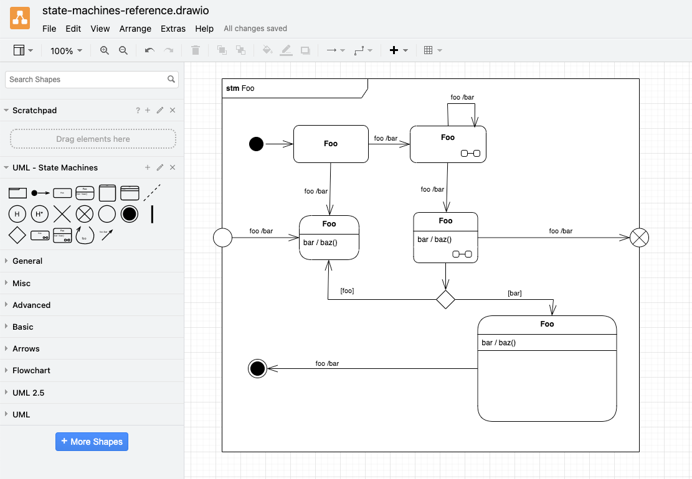

# Drawing UML

This repository contains custom shape libraries for the creation of [UML diagrams](https://www.uml-diagrams.org) with [Diagrams.net](https://en.wikipedia.org/wiki/Diagrams.net).

## Usage

(1) Download the custom shape libraries

```bash
# Git clone via SSH
git clone git@github.com:experimental-software/drawing-uml.git

# Git clone via HTTPS URL
git clone https://github.com/experimental-software/drawing-uml.git

# Download as ZIP archive
curl https://github.com/experimental-software/drawing-uml/archive/refs/heads/master.zip \
  --output drawing-uml.zip
```

(2) Open the app

The app can be opened directly in the browser at https://app.diagrams.net or after downloading it from the [drawio-desktop GitHub releases](https://github.com/jgraph/drawio-desktop/releases/latest).

(3) Create new diagram

(4) Import a library

The libraries from this repository can be imported via the menu entry "File > Open library from > Device".

## Libraries

### State Machines

[][stm-library]
[][stm-syntax]

[stm-library]: https://raw.githubusercontent.com/experimental-software/drawing-uml/master/UML%20-%20State%20Machines.xml
[stm-syntax]: https://www.uml-diagrams.org/state-machine-diagrams.html



## References

- [UML Specification | omg.org](https://www.omg.org/spec/UML/)
- [Work with custom shape libraries | drawio.freshdesk.com](https://drawio.freshdesk.com/support/solutions/articles/16000067790-work-with-custom-shape-libraries)
- [draw.io YouTube channel](https://www.youtube.com/@drawioapp)
