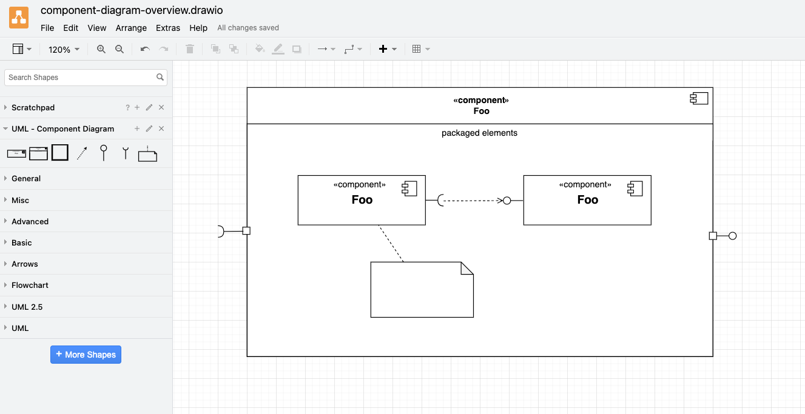

# Drawing UML

This repository contains custom shape libraries for the creation of [UML diagrams](https://www.uml-diagrams.org) with [Diagrams.net](https://en.wikipedia.org/wiki/Diagrams.net).

## Quickstart

https://user-images.githubusercontent.com/5235584/223810663-b40a00d9-c53f-432f-8ac1-eaccd9d1d9c2.mp4

## Usage

### (1) Download the custom shape libraries

The custom shape libraries can be downloaded by clicking on [this link](https://github.com/experimental-software/drawing-uml/archive/refs/heads/main.zip) or by executing either of these Shell commands in the terminal:

```bash
# (a) Download with git clone via SSH
git clone git@github.com:experimental-software/drawing-uml.git

# (b) Download with git clone via HTTPS
git clone https://github.com/experimental-software/drawing-uml.git

# (c) Download ZIP archive via cURL
curl https://codeload.github.com/experimental-software/drawing-uml/zip/refs/heads/main \
  --output drawing-uml.zip
unzip drawing-uml.zip -d .
```

### (2) Open the app

The app can be opened directly in the browser at [app.diagrams.net](https://app.diagrams.net) or after downloading it from the [drawio-desktop GitHub releases](https://github.com/jgraph/drawio-desktop/releases/latest).

### (3) Create new diagram

### (4) Import a library

The libraries from this repository can be imported via the menu entry "File > Open library from > Device".

## Libraries

### State Machine Diagram

[Library URL][state-machine-diagram-library-url] • [UML syntax][state-machine-uml-syntax]

[state-machine-diagram-library-url]: https://raw.githubusercontent.com/experimental-software/drawing-uml/main/UML_StateMachineDiagram.xml
[state-machine-uml-syntax]: https://www.visual-paradigm.com/VPGallery/diagrams/State.html

[raw library url](https://raw.githubusercontent.com/experimental-software/drawing-uml/main/UML%20-%20State%20Machine%20Diagram.xml)


### Communication Diagram


### Component Diagram



### Object Diagram


### Sequence Diagram

[Library URL][sequence-diagram-raw-library-url] • [UML syntax][sequence-diagram-uml-syntax]

[sequence-diagram-raw-library-url]: https://raw.githubusercontent.com/experimental-software/drawing-uml/main/UML_SequenceDiagram.xml
[sequence-diagram-uml-syntax]: https://www.visual-paradigm.com/VPGallery/diagrams/Sequence.html


## References

- [UML Specification | omg.org](https://www.omg.org/spec/UML/)
- [Work with custom shape libraries | drawio.freshdesk.com](https://drawio.freshdesk.com/support/solutions/articles/16000067790-work-with-custom-shape-libraries)
- [draw.io YouTube channel](https://www.youtube.com/@drawioapp)
